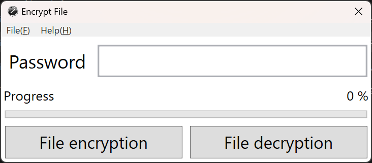

# File Encrypt Tool

The file will be encrypted with a password.

ファイルをパスワードで暗号化します。

---

## System Requirements

- Windows OS
- [.NET 8 Desktop Runtime](https://dotnet.microsoft.com/ja-jp/download/dotnet/8.0)

---

## Usage Instructions

### ○ File Encryption

1. Enter the password.
2. Click the "File encryption" button.
3. Select the file to be encrypted.
4. Specify the destination for the encrypted file.

### ○ File Decryption

1. Enter the password.

2. Click the "File encryption" button.

3. Select the file to be decrypted.

4. Choose the directory to save the decrypted file.

   

## 使い方

### ○ファイルの暗号化

1. パスワードを入力します。
2. 「File encryption」ボタンを押下します。
3. 暗号化するファイルを選択します。
4. 暗号化ファイルの保存先を指定します。

### ○ファイルの複合化

1. パスワードを入力します。
2. 「File encryption」ボタンを押下します。
3. 複合化するファイルを選択します。
4. 複合化ファイルの保存先ディレクトリと選択します。

---

## Used Libraries

- [Yinyang.FileEncrypt](https://github.com/yinyangtm/Yinyang.FileEncrypt)
